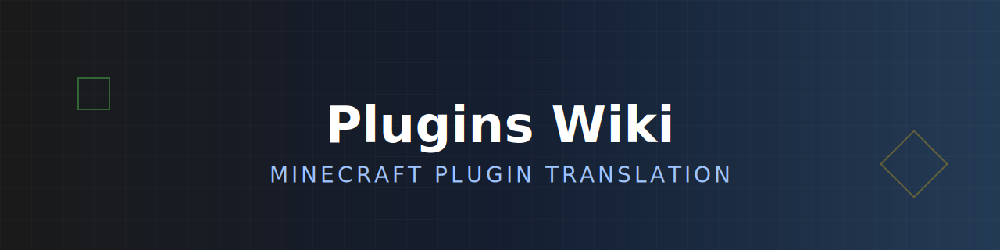

<div align="center">
  
</div>

本项目致力于将优质的 Minecraft 插件英文 Wiki 翻译为中文，并提供统一、现代化的阅读体验。

## 特性

- **多源化**: 内置 Python 爬虫工具 (`scripts/`)，支持从 **GitBook**、**Retype** 等常见文档平台自动抓取原始内容。
- **现代化**: 基于 [Starlight](https://starlight.astro.build/) (Astro) 构建的文档站点，提供响应式设计、黑暗模式和优秀的性能。
- **规范化**: 提供详细的 [翻译 Prompt](TRANSLATION_PROMPT.md) 和术语对照表，确保翻译内容的专业性与风格统一。

## 结构

本项目采用 **Git Worktree** 实现代码与内容的分离：

- **Main 分支** (`/`): 存放项目基础设施代码。
  - `scripts/`: Python 爬虫核心代码。
    - `crawl.py`: 爬虫入口。
    - `wiki_configs.json`: 爬虫源配置。
  - `starlight/`: 文档网站前端项目 (Astro)。
  - `TRANSLATION_PROMPT.md`: 翻译规范与术语表。

- **Content 分支** (挂载于 `starlight/src/content/`): 存放所有文档数据。
  - `docs/`: Markdown 文档源文件（爬虫输出目标）。

## 开始

### 1. 环境准备

请确保本地已安装以下环境：

- **Python**: >= 3.11 (推荐使用 [uv](https://github.com/astral-sh/uv) 进行高效的依赖管理)
- **Node.js**: 推荐最新的 LTS 版本 (v18+)
- **pnpm**: 用于管理前端依赖

### 2. 克隆仓库

由于本项目采用 **Git Worktree** 管理文档内容（代码与内容分离），请严格按照以下步骤克隆与初始化：

```bash
# 克隆主仓库
git clone https://github.com/Ziphyrien/Plugins-Wiki.git
cd Plugins-Wiki

# 挂载 content 分支到 starlight/src/content
git worktree add starlight/src/content content
```

### 3. 安装依赖

**脚本依赖**:

```bash
cd scripts
uv sync
```

**前端依赖**:

```bash
cd ../starlight
pnpm install
```

### 4. 抓取文档

你可以通过修改 `scripts/wiki_configs.json` 来添加或配置需要爬取的 Wiki 源。

```bash
cd ../scripts

# 查看所有可用的 Wiki 配置
python crawl.py -l

# 爬取特定的 Wiki (例如 coinsengine)
python crawl.py coinsengine

# 爬取配置文件中的所有 Wiki
python crawl.py all
```

> **注意**: 爬取的内容会自动输出到 Worktree 挂载的 `starlight/src/content/docs` 目录中。

### 5. 本地预览

```bash
cd ../starlight
pnpm dev
```

启动后访问 <http://localhost:4321> 即可预览文档站点。

## 贡献

我们非常欢迎社区贡献 translations。在开始翻译前，请务必阅读 **[TRANSLATION_PROMPT](TRANSLATION_PROMPT.md)** 以了解详细规范。

## 许可证

ISC
